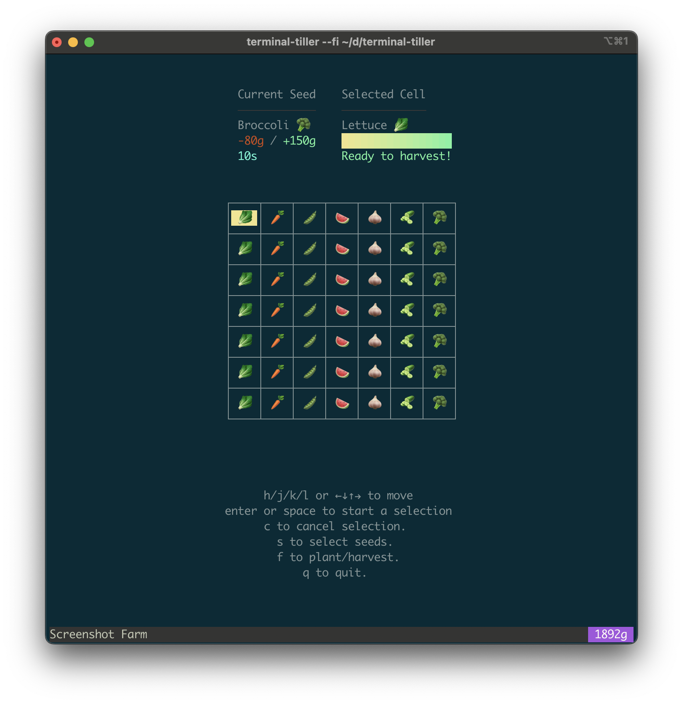

# Terminal Tiller

Terminal Tiller is a simple idle game to grow, harvest, and sell crops from your terminal!

Built with tools from [charm.sh](https://charm.sh)!



## Install

```shell
go install github.com/calvinmclean/terminal-tiller@latest
```

## Play
After installing, simply run:

```shell
terminal-tiller
```

This will create a new save file in `~/.terminal-tiller`

See the on-screen usage instructions and start planting! When you close the game, the state is saved and your crops will continue growing!
